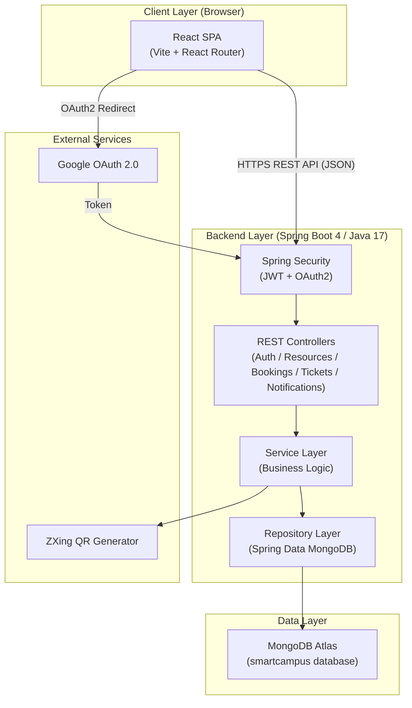
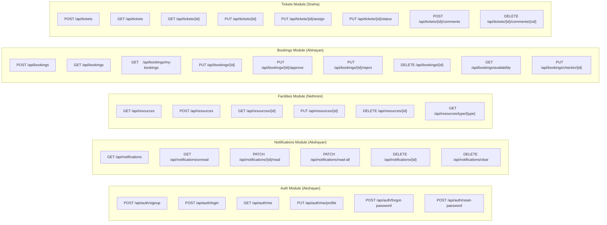
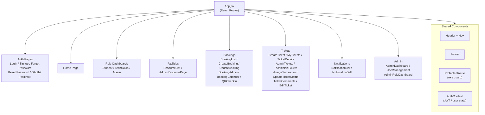

# Smart Campus Operations Hub — Final Report Draft

**Module:** IT3030 — Programming Applications Framework (PAF)  
**Year:** 2026  
**Group:** 58  
**GitHub:** [AK29-Shay/it3030-paf-2026-smart-campus-group58](https://github.com/AK29-Shay/it3030-paf-2026-smart-campus-group58)

---

## 1. Introduction

The **Smart Campus Operations Hub** is a full-stack web application built for Sri Lanka Institute of Information Technology (SLIIT) to digitise and streamline core campus operations. The platform enables students, technicians, and administrators to manage campus facilities, book resources, raise IT support tickets, and receive real-time notifications — all through a single unified interface.

The application follows a **layered REST architecture** with a Java Spring Boot backend, a React frontend, and a MongoDB Atlas database. Authentication is handled via Google OAuth 2.0 and local JWT tokens. The innovation feature — **QR Code Check-In** — allows approved booking holders to check in to rooms and labs by scanning a system-generated QR code, bringing physical verification into the digital workflow.

---

## 2. Functional Requirements

| ID | Requirement | Module | Status |
|----|-------------|--------|--------|
| FR-01 | Users can register and log in with email/password | Auth | ✅ |
| FR-02 | Users can log in with Google OAuth 2.0 | Auth | ✅ |
| FR-03 | Role-based access control (USER, ADMIN, TECHNICIAN) | Auth | ✅ |
| FR-04 | Admin can manage user roles | Auth | ✅ |
| FR-05 | Browse campus resources with search and filter | Facilities | ✅ |
| FR-06 | Admin can create, update, and delete resources | Facilities | ✅ |
| FR-07 | Resources have metadata (type, category, capacity, location) | Facilities | ✅ |
| FR-08 | Users can create and view their bookings | Bookings | ✅ |
| FR-09 | Bookings follow PENDING → APPROVED / REJECTED workflow | Bookings | ✅ |
| FR-10 | System prevents overlapping bookings for the same resource | Bookings | ✅ |
| FR-11 | Admin can approve or reject bookings with a reason | Bookings | ✅ |
| FR-12 | Approved bookings generate a QR code for check-in | Innovation | ✅ |
| FR-13 | Users can raise IT support tickets with image attachments (up to 3) | Tickets | ✅ |
| FR-14 | Tickets follow OPEN → IN_PROGRESS → RESOLVED → CLOSED workflow | Tickets | ✅ |
| FR-15 | Admin can assign tickets to technicians | Tickets | ✅ |
| FR-16 | Users and technicians can comment on tickets | Tickets | ✅ |
| FR-17 | Users receive web UI notifications on booking/ticket status changes | Notifications | ✅ |
| FR-18 | Users can mark notifications as read / clear all | Notifications | ✅ |

---

## 3. Non-Functional Requirements

| ID | Requirement | Implementation |
|----|-------------|---------------|
| NFR-01 | RESTful API naming and HTTP status codes | All controllers use standard HTTP methods and status codes |
| NFR-02 | Stateless authentication | JWT tokens; no server-side sessions |
| NFR-03 | Password hashing | BCrypt via Spring Security |
| NFR-04 | Input validation | `@Valid` + Jakarta Bean Validation on all DTOs |
| NFR-05 | CORS configuration | Configurable allowed origins via `SecurityConfig` |
| NFR-06 | Responsive frontend | React with CSS media queries |
| NFR-07 | Conflict prevention | `BookingService` checks existing PENDING/APPROVED bookings for time overlap |
| NFR-08 | File storage | Multipart image uploads stored in `/uploads` directory |

---

## 4. Architecture Diagrams

### 4.1 Overall System Architecture



### 4.2 REST API Architecture



### 4.3 Frontend Architecture



---

## 5. System Functions & Member Contributions

### 5.1 Member 1 — Nethmini (Facilities / Resources)

**Backend — `ResourceController.java`**

| Method | Endpoint | Description |
|--------|----------|-------------|
| GET | `/api/resources` | Retrieve all campus resources |
| POST | `/api/resources` | Create a new resource (Admin only) |
| GET | `/api/resources/{id}` | Get resource by ID |
| PUT | `/api/resources/{id}` | Update resource (Admin only) |
| DELETE | `/api/resources/{id}` | Delete resource (Admin only) |
| GET | `/api/resources/type/{type}` | Filter resources by type |
| GET | `/api/resources/location/{location}` | Filter resources by location |

**Frontend Components:**
- `ResourceList.jsx` — searchable, filterable resource catalogue with cards
- `AdminResourcePage.jsx` — CRUD UI for admin to manage resources

**Key Features:**
- Resources have type, category, status, capacity, location, and image URL
- Full search and multi-field filtering on the catalogue page
- Admin-only create/edit/delete with modal forms

---

### 5.2 Member 2 — Abinayan (Bookings)

**Backend — `BookingController.java`**

| Method | Endpoint | Description |
|--------|----------|-------------|
| POST | `/api/bookings` | Create a booking (PENDING) |
| GET | `/api/bookings` | Get all bookings (Admin) |
| GET | `/api/bookings/my-bookings` | Get current user's bookings |
| GET | `/api/bookings/{id}` | Get booking by ID |
| PUT | `/api/bookings/{id}` | Update booking details |
| PUT | `/api/bookings/{id}/approve` | Approve booking (Admin) |
| PUT | `/api/bookings/{id}/reject` | Reject booking with reason (Admin) |
| PUT | `/api/bookings/{id}/cancel` | Cancel booking |
| DELETE | `/api/bookings/{id}` | Delete booking |
| GET | `/api/bookings/availability` | Check time-slot availability |
| PUT | `/api/bookings/checkin/{id}` | QR check-in (Innovation) |

**Frontend Components:**
- `BookingList.jsx` — user's booking history with status badges
- `CreateBooking.jsx` — form with conflict-check
- `UpdateBooking.jsx` — edit pending bookings
- `BookingAdmin.jsx` — admin approve/reject panel
- `BookingCalendar.jsx` — visual calendar view

**Key Features:**
- Real-time availability check before submission
- PENDING/APPROVED/REJECTED status workflow
- Conflict prevention: overlapping bookings rejected at service layer

---

### 5.3 Member 3 — Sneha (Tickets)

**Backend — `TicketController.java`**

| Method | Endpoint | Description |
|--------|----------|-------------|
| POST | `/api/tickets` | Create ticket with image attachments |
| GET | `/api/tickets` | Get all tickets (Admin/Technician) |
| GET | `/api/tickets/{id}` | Get ticket by ID |
| PUT | `/api/tickets/{id}` | Edit ticket details |
| PUT | `/api/tickets/{id}/status` | Update ticket status |
| PUT | `/api/tickets/{id}/assign` | Assign technician (Admin) |
| GET | `/api/tickets/{id}/assignment-history` | View assignment history |
| POST | `/api/tickets/{id}/comments` | Add comment |
| PUT | `/api/tickets/{id}/comments/{cid}` | Edit comment |
| DELETE | `/api/tickets/{id}/comments/{cid}` | Delete comment |
| GET | `/api/tickets/{id}/comments` | List comments |

**Frontend Components:**
- `CreateTicket.jsx` — form with up to 3 image attachments, category, priority
- `MyTickets.jsx` — student's ticket list
- `AdminTickets.jsx` — admin view with assign/status controls
- `TechnicianTickets.jsx` — technician's assigned queue
- `TicketDetails.jsx`, `AdminTicketDetails.jsx` — full detail views
- `TicketComments.jsx` — threaded comments with replies
- `AssignTechnician.jsx`, `UpdateTicketStatus.jsx` — action forms

**Key Features:**
- OPEN → IN_PROGRESS → RESOLVED → CLOSED lifecycle
- Up to 3 image attachments stored in `/uploads`
- Threaded comments with reply support
- Assignment history log

---

### 5.4 Member 4 — Akshayan (Auth + Notifications)

**Backend — `AuthController.java` + `NotificationController.java`**

| Method | Endpoint | Description |
|--------|----------|-------------|
| POST | `/api/auth/signup` | Register new account |
| POST | `/api/auth/login` | Login with email/password |
| GET | `/api/auth/me` | Get current user info |
| PUT | `/api/auth/me/profile` | Update profile |
| PUT | `/api/auth/me/notification-settings` | Update notification preferences |
| POST | `/api/auth/forgot-password` | Request password reset token |
| POST | `/api/auth/reset-password` | Complete password reset |
| GET | `/api/notifications` | List all notifications |
| GET | `/api/notifications/unread` | List unread notifications |
| GET | `/api/notifications/unread/count` | Unread count badge |
| PATCH | `/api/notifications/{id}/read` | Mark one as read |
| PATCH | `/api/notifications/read-all` | Mark all as read |
| DELETE | `/api/notifications/{id}` | Delete notification |
| DELETE | `/api/notifications/clear` | Clear all notifications |

**Frontend Components:**
- `LoginPage.jsx`, `SignupPage.jsx` — auth forms
- `OAuth2RedirectHandler.jsx` — handles Google OAuth2 token handoff
- `ForgotPasswordPage.jsx`, `ResetPasswordPage.jsx` — password flow
- `NotificationBell.jsx` — real-time unread count in header
- `NotificationList.jsx` — full notification history
- `ProtectedRoute.jsx`, `AuthContext.jsx` — auth state management
- `StudentDashboard.jsx`, `TechnicianDashboard.jsx`, `AdminRoleDashboard.jsx`

**Key Features:**
- Dual auth strategy: local JWT + Google OAuth 2.0
- Role-based routing guards (USER / ADMIN / TECHNICIAN)
- Notification bell with live unread count
- Automatic notification generation on booking/ticket status changes

---

## 6. Innovation Feature — QR Code Check-In System (10 Marks)

### What it does
When a booking is **approved** by an admin, the system automatically generates a **QR code** containing encoded booking data. The QR links to a verification page. When a student arrives at the booked room, they scan this QR code (or an admin scans it on their behalf), and the booking is marked as **CHECKED_IN** in the system.

### Why it's innovative
No standard campus booking system combines physical-world verification with the digital approval workflow. This closes the loop: a booking isn't just approved on paper — the student's physical presence is logged.

### Technical Implementation

**Backend (`QRCodeService.java`):**
```java
// On approval, BookingService calls:
String qrPath = qrCodeService.generateQRCode(booking);

// QRCodeService encodes booking JSON + verification URL:
// → frontendUrl/qr-verify/{id}?data={encodedBookingJSON}
// → Saves QR PNG to src/main/resources/static/qr/qr_{id}.png
// → BookingController exposes PUT /api/bookings/{id}/qr for regeneration
// → BookingController exposes PUT /api/bookings/checkin/{id} for check-in
```

**Frontend:**
- `QRCheckInPage.jsx` — decodes URL params, displays booking info, calls check-in API
- `MockScannerPage.jsx` — admin-only mock QR scanner UI
- `MockVerifyPage.jsx` — verification result display

**Flow:**
```
Admin approves booking → QR generated → Student scans QR →
QRCheckInPage loads → Booking details displayed →
"Check In" button → PUT /api/bookings/checkin/{id} →
Booking status = CHECKED_IN → Notification sent
```

### API Endpoints
| Method | Endpoint | Description |
|--------|----------|-------------|
| PUT | `/api/bookings/{id}/approve` | Approve and auto-generate QR |
| PUT | `/api/bookings/{id}/qr` | Regenerate QR (Admin) |
| PUT | `/api/bookings/checkin/{id}` | Check in via QR scan |
| GET | `/qr-verify/:id` | Frontend QR landing page |

---

## 7. Screenshots

> **Note:** Screenshots were captured from the live local development environment and the GitHub repository. Insert the images from `docs/screenshots/` at the placeholders below.

### 7.1 Frontend UI

**[SCREENSHOT: 01_home.png]**  
*Home page — landing screen with navigation*

**[SCREENSHOT: 02_login.png]**  
*Login page — local + Google OAuth2 sign-in*

**[SCREENSHOT: 03_student_dashboard.png]**  
*Student dashboard — role-based landing after login*

**[SCREENSHOT: 04_resources.png]**  
*Facilities catalogue — resource list with search and filter*

**[SCREENSHOT: 05_admin_resources.png]**  
*Admin resources page — create/edit/delete resources*

**[SCREENSHOT: 06_create_booking.png]**  
*Create booking — form with availability check*

**[SCREENSHOT: 07_booking_list.png]**  
*My bookings — booking history with status badges*

**[SCREENSHOT: 08_booking_calendar.png]**  
*Booking calendar — visual calendar view*

**[SCREENSHOT: 09_booking_admin.png]**  
*Admin booking panel — approve/reject workflow*

**[SCREENSHOT: 10_qr_checkin.png]**  
*QR Check-In page — innovation feature verification screen*

**[SCREENSHOT: 11_create_ticket.png]**  
*Create ticket — form with image upload, category and priority*

**[SCREENSHOT: 12_my_tickets.png]**  
*My tickets — student's support ticket list*

**[SCREENSHOT: 13_admin_tickets.png]**  
*Admin tickets — full ticket management panel*

**[SCREENSHOT: 14_ticket_details.png]**  
*Ticket details — full view with comments thread*

**[SCREENSHOT: 15_notifications.png]**  
*Notifications — notification bell and full list*

**[SCREENSHOT: 16_admin_dashboard.png]**  
*Admin dashboard — overview and navigation*

**[SCREENSHOT: 17_user_management.png]**  
*User management — admin role assignment*

### 7.2 GitHub Repository

**[SCREENSHOT: 18_github_commits.png]**  
*GitHub — commit history showing all member contributions*

**[SCREENSHOT: 19_github_branches.png]**  
*GitHub — branch structure (main, dev, member-1 through member-4)*

**[SCREENSHOT: 20_github_pr_list.png]**  
*GitHub — merged pull requests from each member*

### 7.3 Database Evidence

**[SCREENSHOT: 21_mongodb_collections.png]**  
*Terminal — MongoDB collection listing via `scripts/query_mongodb.py`*

**[SCREENSHOT: 22_mongodb_users.png]**  
*Terminal — Users collection with roles*

**[SCREENSHOT: 23_mongodb_bookings.png]**  
*Terminal — Bookings collection with statuses*

### 7.4 API Testing Evidence (curl)

**[SCREENSHOT: 24_curl_auth.png]**  
*Terminal — POST /api/auth/login response with JWT token*

**[SCREENSHOT: 25_curl_resources.png]**  
*Terminal — GET /api/resources JSON response*

**[SCREENSHOT: 26_curl_bookings.png]**  
*Terminal — GET /api/bookings/my-bookings JSON response*

**[SCREENSHOT: 27_curl_tickets.png]**  
*Terminal — GET /api/tickets JSON response*

**[SCREENSHOT: 28_curl_notifications.png]**  
*Terminal — GET /api/notifications/unread/count response*

---

## 8. AI Disclosure Statement

In accordance with the SLIIT Academic Integrity Policy and the requirements of IT3030 PAF 2026, this statement discloses the use of AI tools during the development of this project.

**AI Tools Used:**
- **GitHub Copilot** — used for code autocompletion suggestions within the IDE during backend and frontend development
- **Antigravity (Google DeepMind)** — used for: automated code review and gap analysis, generating the MongoDB evidence query script (`scripts/query_mongodb.py`), generating the API test script (`scripts/api_tests.sh`), creating the `vercel.json` deployment configuration, and drafting this final report

**Scope of AI Assistance:**
All core functional code (REST controllers, services, entities, repositories, React components, authentication flows) was written by the team members. AI tools were used primarily for:
1. Code review and identifying missing requirements
2. Generating documentation and report structure
3. Generating utility/evidence scripts that are not part of the core submission
4. Suggesting code completions (not full implementations)

**Human Authorship:** All architectural decisions, data models, business logic, and UI design were conceived and implemented by the four team members. AI suggestions were reviewed, modified, and approved by the relevant team member before integration.

**Declaration:** We confirm that this disclosure accurately represents the use of AI tools in this project, and that the core submission represents the original work of Group 58.

| Member | Student ID | Contribution |
|--------|-----------|--------------|
| Nethmini | [ID] | Module A — Facilities / Resources |
| Abinayan | [ID] | Module B — Bookings |
| Sneha (Dhayabari) | [ID] | Module C — Tickets |
| Akshayan | [ID] | Module D — Auth + Notifications |

---

## 9. Deployment

| Component | Platform | URL |
|-----------|----------|-----|
| Frontend (React) | Vercel | *(URL after deployment)* |
| Backend (Spring Boot) | Local / Railway | `http://localhost:8080` |
| Database | MongoDB Atlas | `cluster0.wergga1.mongodb.net/smartcampus` |

**Vercel Configuration:** `frontend/smartcampus/vercel.json` — SPA rewrites configured so React Router handles all client-side routes.

---

*End of Final Report Draft — Group 58, IT3030 PAF 2026*
